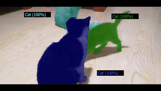
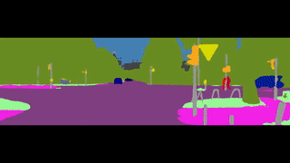
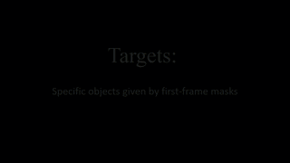
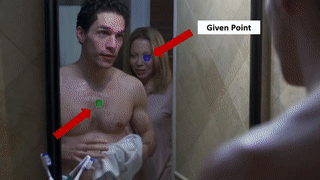

# TarViS: A Unified Architecture for Target-based Video Segmentation (CVPR'23 Highlight)

[Ali Athar](https://www.aliathar.net/), Alexander Hermans, Jonathon Luiten, Deva Ramanan, Bastian Leibe

[`PDF`](https://arxiv.org/pdf/2301.02657.pdf) | [`YouTube`](https://www.youtube.com/watch?v=qecFRmSYq40&t=3s) | [`Paperswithcode`](https://paperswithcode.com/paper/tarvis-a-unified-approach-for-target-based) | [`Cite`](https://github.com/Ali2500/TarViS/blob/main/README.md#cite)

| Video Instance Segmentation | Video Panoptic Segmentation | Video Object Segmentation | Point Exemplar-guided Tracking |
| --- | --- | --- | --- |
|  |  |  |  |

[](https://paperswithcode.com/sota/video-instance-segmentation-on-youtube-vis-2?p=tarvis-a-unified-approach-for-target-based)
[](https://paperswithcode.com/sota/video-instance-segmentation-on-ovis-1?p=tarvis-a-unified-approach-for-target-based)
[](https://paperswithcode.com/sota/video-panoptic-segmentation-on-vipseg?p=tarvis-a-unified-approach-for-target-based)
[](https://paperswithcode.com/sota/video-panoptic-segmentation-on-kitti-step?p=tarvis-a-unified-approach-for-target-based)
[](https://paperswithcode.com/sota/video-panoptic-segmentation-on-cityscapes-vps?p=tarvis-a-unified-approach-for-target-based)
[](https://paperswithcode.com/sota/visual-object-tracking-on-davis-2017?p=tarvis-a-unified-approach-for-target-based)
[](https://paperswithcode.com/sota/on-burst-point-exemplar-guided-val?p=tarvis-a-unified-approach-for-target-based)
[](https://paperswithcode.com/sota/on-burst-point-exemplar-guided-test?p=tarvis-a-unified-approach-for-target-based)

## Updates

**30.04.2023:** Complete code and pre-trained checkpoints uploaded.

## Abstract

> The general domain of video segmentation is currently fragmented into different tasks spanning multiple benchmarks. Despite rapid progress in the state-of-the-art, current methods are overwhelmingly task-specific and cannot conceptually generalize to other tasks. Inspired by recent approaches with multi-task capability, we propose TarViS: a novel, unified network architecture that can be applied to any task that requires segmenting a set of arbitrarily def ined ‘targets’ in video. Our approach is flexible with respect to how tasks define these targets, since it models the latter as abstract ‘queries’ which are then used to predict pixel-precise target masks. A single TarViS model can be trained jointly on a collection of datasets spanning different tasks, and can hot-swap between tasks during inference without any task-specific retraining. To demonstrate its effectiveness, we apply TarViS to four different tasks, namely Video Instance Segmentation (VIS), Video Panoptic Segmentation (VPS), Video Object Segmentation (VOS) and Point Exemplar-guided Tracking (PET). Our unified, jointly trained model achieves state-of-the-art performance on 5/7 benchmarks spanning these four tasks, and competitive performance on the remaining two

## Setup


#### Environment Setup

1) Create a conda environment with python 3.7

```bash
conda create -n tarvis python=3.7
```

2) Install PyTorch v1.11. We developed the code base on a workstation with an RTX3090 GPU and CUDA v11.1

```
conda install pytorch==1.11.0 torchvision==0.12.0 torchaudio==0.11.0 cudatoolkit=11.3 -c pytorch
```

3) Install other dependencies from pip

```
pip install -r requirements.txt
```

4) Install detectron2 v0.6.

```
git clone https://github.com/facebookresearch/detectron2.git
cd detectron2
git checkout v0.6
python -m pip install -e .
```

In case these instructions become outdated, refer to the [instructions](https://detectron2.readthedocs.io/en/latest/tutorials/install.html) on the official website.

5) Add the repository base dir to `PYTHONATH`

```
export PYTHONPATH=$(pwd)
```

6) Build the deformable attention CUDA kernels as follows:

```
cd tarvis/modelling/backbone/temporal_neck/ops
bash make.sh
```

If you already have the kernels from Mask2Former installed in your environment then you can skip this step since they're identical.

#### Directory Structure

For managing datasets, checkpoints and pretrained backbones, we use a single environment variable `$TARVIS_WORKSPACE_DIR` which points to a directory that is organized as follows:

```
├── $TARVIS_WORKSPACE_DIR
│   ├── checkpoints                   <- model weights saved here during training
│   ├── pretrained_backbones          <- ImageNet pretrained Swin backbone weights
│   ├── dataset_images                <- Images/videos for all datasets go here
|   |   ├── training
|   |   |   ├── ade20k               
|   |   |   |   ├── ADE_train_00000001.jpg
|   |   |   |   ├── ...
|   |   |   ├── cityscapes
|   |   |   |   ├── aachen
|   |   |   |   ├── ...
|   |   |   ├── coco
|   |   |   |   ├── 000000000009.jpg
|   |   |   |   ├── ...
|   |   |   ├── mapillary
|   |   |   |   ├── 0035fkbjWljhaftpVM37-g.jpg
|   |   |   |   ├── ...
|   |   |   ├── cityscapes_vps
|   |   |   |   ├── 0001_0001_frankfurt_000000_000279_newImg8bit.png
|   |   |   |   ├── ...
|   |   |   ├── kitti_step
|   |   |   |   ├── 0000
|   |   |   |   ├── ...
|   |   |   ├── vipseg
|   |   |   |   ├── 0_wHveSGjXyDY
|   |   |   |   ├── ...
|   |   |   ├── youtube_vis_2021
|   |   |   |   ├── 3245e049fb
|   |   |   |   ├── ...
|   |   |   ├── ovis
|   |   |   |   ├── 001ca3cb
|   |   |   |   ├── ...
|   |   |   ├── davis 
|   |   |   |   ├── bear
|   |   |   |   ├── ...
|   |   |   ├── burst   
|   |   |   |   ├── YFCC100M
|   |   |   |   ├── ...
|   |   ├── inference
|   |   |   ├── cityscapes_vps_val     <- same directory structure as training
|   |   |   ├── kitti_step_val
|   |   |   ├── vipseg
|   |   |   ├── youtube_vis_2021     
|   |   |   ├── ovis
|   |   |   ├── davis                 
|   |   |   ├── burst
|   |   |   |   ├── val
|   |   |   |   |   ├── YFCC100M
|   |   |   |   |   ├── ...
|   |   |   |   ├── test
|   |   |   |   |   ├── YFCC100M
|   |   |   |   |   ├── ...
|   ├── dataset_annotations            <- Annotations for all datasets go here
|   |   ├── training
|   |   |   ├── ade20k_panoptic    
|   |   |   |   ├── pan_maps
|   |   |   |   |   ├── ADE_train_00000001.png
|   |   |   |   ├── segments.json
|   |   |   ├── cityscapes_panoptic
|   |   |   |   ├── pan_maps
|   |   |   |   |   ├── aachen_000000_000019_gtFine_panoptic.png
|   |   |   |   |   ├── ...
|   |   |   |   ├── segments.json
|   |   |   ├── coco_panoptic
|   |   |   |   ├── pan_maps
|   |   |   |   |   ├── 000000000009.png
|   |   |   |   |   ├── ...
|   |   |   |   ├── segments.json
|   |   |   ├── mapillary_panoptic
|   |   |   |   ├── pan_maps    
|   |   |   |   |   ├── 0035fkbjWljhaftpVM37-g.png
|   |   |   |   |   ├── ...
|   |   |   |   ├── segments.json
|   |   |   ├── cityscapes_vps.json
|   |   |   ├── kitti_step.json
|   |   |   ├── vipseg
|   |   |   |   ├── panoptic_masks
|   |   |   |   |   ├── 0_wHveSGjXyDY
|   |   |   |   |   ├── ...
|   |   |   |   ├── video_info.json
|   |   |   ├── youtube_vis_2021.json
|   |   |   ├── ovis.json
|   |   |   ├── davis_semisupervised.json
|   |   |   ├── burst.json
|   |   ├── inference   
|   |   |   ├── cityscapes_vps
|   |   |   |   ├── im_all_info_val_city_vps.json
|   |   |   ├── vipseg
|   |   |   |   ├── val.json
|   |   |   ├── youtube_vis
|   |   |   |   ├── valid_2021.json
|   |   |   ├── ovis
|   |   |   |   ├── valid.json
|   |   |   ├── davis
|   |   |   |   ├── Annotations
|   |   |   |   ├── ImageSet_val.txt
|   |   |   |   ├── ImageSet_testdev.txt
|   |   |   ├── burst
|   |   |   |   ├── first_frame_annotations_val.json
|   |   |   |   ├── first_frame_annotations_test.json
```

You do not need to setup all the datasets if you only want to train/infer on a sub-set of them. For training the full model however, you need the complete directory tree above. All paths in-code are provided from [tarvis/utils/paths.py](https://github.com/Ali2500/TarViS/blob/main/tarvis/utils/paths.py), so any changes can be easily made there.

#### Partially complete workspace directory download

To make the setup easier, you can download a partially complete workspace directory from [HERE](https://omnomnom.vision.rwth-aachen.de/data/TarViS/tarvis_workspace_dir.zip). It does not include any image files, but it does contain all the JSON format annotation files. For some datasets, e.g. DAVIS, we converted the dataset annotations into a custom format to make it easier to re-use data loading code.

**Important:** The license agreement for this repository does not apply to the annotations. Please refer to the license agreements for the respective datasets if you wish to use these annotations.

## Trained Models

Download links to trained checkpoints are available below. Each zipped directory contains a checkpoint file ending with `.pth` and a `config.yaml` file. We also provide checkpoints for the models after the pre-training step on augmented image sequences.

| Backbone  | Pretrain (augmented images) | Finetune (video) |
|-----------|-----------------------------|------------------|
| ResNet-50 | [URL](https://omnomnom.vision.rwth-aachen.de/data/TarViS/resnet50_pretrain.zip)                         | [URL](https://omnomnom.vision.rwth-aachen.de/data/TarViS/resnet50_finetune.zip)              |
| Swin-T    | [URL](https://omnomnom.vision.rwth-aachen.de/data/TarViS/swin-tiny_pretrain.zip)                         | [URL](https://omnomnom.vision.rwth-aachen.de/data/TarViS/swin-tiny_finetune.zip)              |
| Swin-L    | [URL](https://omnomnom.vision.rwth-aachen.de/data/TarViS/swin-large_pretrain.zip)                         | [URL](https://omnomnom.vision.rwth-aachen.de/data/TarViS/swin-large_finetune.zip)              |

## Inference

Run the following command with the desired dataset. The checkpoint path can be any of the finetuned models from the the download links above, or models that you train yourself. It is important that `config.yaml` is also present in the same directory as the checkpoint `.pth` file.

```python
python tarvis/inference/main.py /path/to/checkpoint.pth --dataset {YOUTUBE_VIS,OVIS,CITYSCAPES_VPS,KITTI_STEP,DAVIS,BURST} --amp --output_dir /path/to/output/directory
```

Run `python tarvis/inference/main.py --help` to see additional options.

## Training

First run the pretraining on augmented image datasets (COCO, ADE20k, Cityscapes, Mapillary). The following command does this assuming 8 nodes, each containing 4 GPUs:

```python
torchrun --nnodes=8 --nproc_per_node=4 --rdzv_id=22021994 --rdzv_backend=c10d --rdzv_endpoint ${DDP_HOST_ADDRESS} tarvis/training/main.py --model_dir my_first_tarvis_pretraining --cfg pretrain_{resnet50_swin-tiny,swin-large}.yaml --amp  --cfg.MODEL.BACKBONE {ResNet50,SwinTiny,SwinLarge} 
```

The variable `${DDP_HOST_ADDRESS}` should be set to the name of one of the participating nodes. `--model_dir` is where the checkpoints, config and logs will be saved. If a relative path is given it will be appended to `${TARVIS_WORKSPACE_DIR}/checkpoints`, but you can also give as absolute path.

Then run the finetuning on video data (YouTube-VIS, OVIS, KITTI-STEP, Cityscapes-VPS, VIPSeg, DAVIS, BURST):

```python
torchrun --nnodes=8 --nproc_per_node=4 --rdzv_id=22021994 --rdzv_backend=c10d --rdzv_endpoint ${DDP_HOST_ADDRESS} tarvis/training/main.py --model_dir my_first_tarvis_finetuning --cfg finetune_{resnet50_swin-tiny,swin-large}.yaml --amp  --finetune_from /path/to/my_first_tarvis_pretraining
```

For this, the `--finetune_from` argument should point to the pretraining directory (not the checkpoint file). It will automatically load the latest checkpoint from this directory.

### Notes on Training

- To run on a single GPU, omit `torchrun` and its arguments and just run the script normally: `python tarvis/training/main.py ...`
- The training code applies gradient accumulation, so the batch size specified in the config (32 by default) is maintained regardless of how many GPUs are used e.g. if you use 8 GPUs, the gradients for 4 consecutive iterations will be accumulated before running `optimizer.step()`. The only constraint is that the batch size should be exactly divisible by the number of GPUs.
- Training can be resumed from a checkpoint by running the training script as follows: 

```python
torchrun --nnodes=8 --nproc_per_node=4 --rdzv_id=22021994 --rdzv_backend=c10d --rdzv_endpoint ${DDP_HOST_ADDRESS} tarvis/training/main.py --restore_session /path/to/latest/checkpoint.pth
```

- The data loading code uses OpenCV which sometimes behaves strangely on compute clusters by spawning too many worker threads. If you experience slow data loading times, try setting `OMP_NUM_THREADS=1` and running the training script with `--cv2_num_threads=2`.
- Training metrics are logged using tensorboard by default, but logging with weights and biases is also supported by provided the `--wandb_session` option.
- With the default settings, each GPU should have at least 24GB VRAM to prevent OOM errors. If you want to train on smaller GPUs, consider reducing the input image resolution. This is specified in the config separately for each dataset. See `cfg.DATASETS.{dataset_name}.TRAINING`.
- Run `python tarvis/training/main.py --help` to see additional options.

## Cite

```
@inproceedings{athar2023tarvis,
  title={TarViS: A Unified Architecture for Target-based Video Segmentation},
  author={Athar, Ali and Hermans, Alexander and Luiten, Jonathon and Ramanan, Deva and Leibe, Bastian},
  booktitle={CVPR},
  year={2023}
}
```
